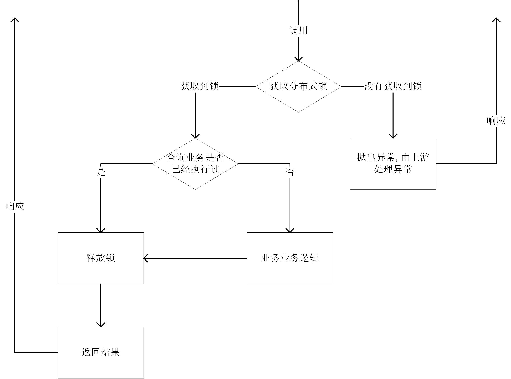

# idempotent
  同时支持JDBC与Redis做幂等的幂等组件
  
## 介绍
### 1.JDBC做幂等
### 1.1 实现方式  
  基于一张幂等表  示例: [tb_idempotent](../idempotent/idempotent-db/src/script/Idempotent.sql),其中幂等key必须为唯一索引. 
  执行过程: 
  1. 开启事务
  2. 生成业务唯一的幂等key
  3. 幂等key插入幂等表中
  4. 执行业务逻辑
  5. 业务执行结果序列化为Json,并通过幂等key,更新到幂等表中
  6. 事务提交  
  其中在第三步,如果由于数据库唯一索引插入失败, 则查询幂等表中之前序列化的结果,将结果反序列化,返回给调用方, 不在执行4, 5.

### 1.2 适用场景
  1.执行业务逻辑主要是对数据库进行操作,并且不是大事务
  2.幂等key与该业务关联较弱(例如幂等key只是一个流水号,对业务的数据模型毫无意义)

### 1.3 优势
  1.对业务几乎无侵入
  2.上游调用方无论调用多少次获取的结果都是一模一样
  3.可以很长时间保持幂等结果 

### 1.4 劣势
  1.必须要数据库事务的支持
  3.相同的幂等key,只会有一个拿到数据库的写锁,等到事务结束之后释放锁. 大事务场景,有可能导致没有拿到锁的线程长时间阻塞.
  4.幂等key, 执行结果保存在数据库,编程时需要主要字段长度问题
  5.执行结果的Java模型不能随意更改,否则可能会导致序列化问题
    
### 2.Redis做幂等
### 2.1 实现方式 
   基于Redis的分布式锁实现.  
   执行过程: 

 
### 2.2 适用场景
  1.业务逻辑与外部交互复杂(比如即有远程调用,也有数据据操作等),且调用链较长
  2.不希望调用方阻塞
  
### 2.3 优势
  1.可以快速响应,获取不到锁直接抛出异常不阻塞调用方
  2.不强依赖于数据库事务
  
### 2.4 劣势  
  1.对业务有侵入,业务方法需要首先查询当前业务有没有执行过
  2.调用方需要自行处理连续请求时抛出的异常

## 使用 

### 1.加入依赖
`JDBC:`
```
<dependency>
    <groupId>com.weweibuy.framework</groupId>
    <artifactId>idempotent-db</artifactId>
</dependency>
```
`redis:`
```
<dependency>
    <groupId>com.weweibuy.framework</groupId>
    <artifactId>idempotent-redis</artifactId>
</dependency>
```
  开启补偿: 在配置类加上注解: 
  ```
  @EnableIdempotent
  ```
### 2.使用
####  2.1使用注解: 
  使用注解:
```
@Idempotent
```
  标记在需要幂等的方法上,通过SPEL指定幂等key的生成规则:
  示例:   [IdempotentService](../samples/src/main/java/com/weweibuy/framework/samples/idempotent/IdempotentService.java) 

####  2.2 配置
#####  2.2.1 idempotent-db 配置:
   [JdbcIdempotentProperties](../idempotent/idempotent-db/src/main/java/com/weweibuy/framework/idempotent/db/JdbcIdempotentProperties.java) 

`application.yml:`
```
idempotent:
  jdbc:  # sql 配置根据自己表配置可能不同
    insert-sql: "INSERT INTO idempotent SET idem_key =  ? "
    update-sql: "UPDATE idempotent SET exec_result = ? WHERE idem_key = ? "
    select-sql: "SELECT exec_result FROM idempotent WHERE idem_key = ? "
```
#####  2.2.1 idempotent-redis 配置:
   [RedisIdempotentProperties](../idempotent/idempotent-redis/src/main/java/com/weweibuy/framework/idempotent/redis/RedisIdempotentProperties.java) 
`application.yml:`
```
idempotent:
  redis:  # sql 配置根据自己表配置可能不同
    key-prefix: xxxx  # 默认: idem:
```

